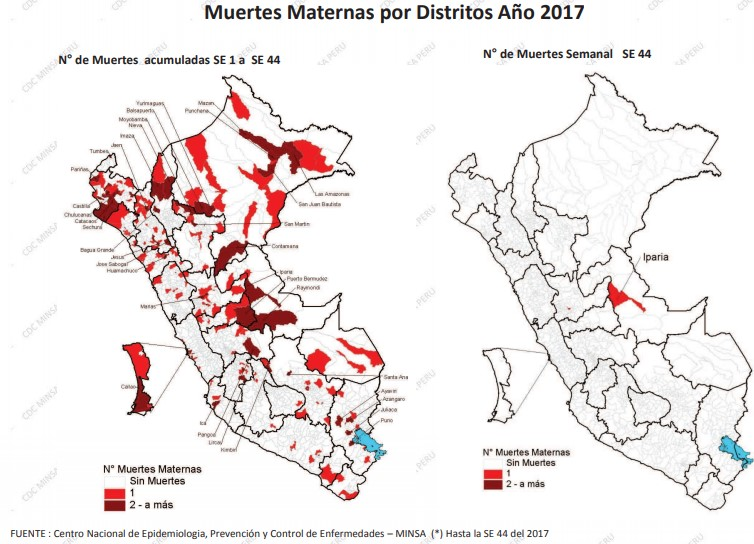

<h1>Anemia Ferropénica</h1>

La carencia de hierro, o ferropenia, es el trastorno nutricional más extendido en todo el planeta. Afecta a 2000 millones de personas –más del 30% de la población mundial–un problema que en las regiones de escasos recursos con frecuencia se ve agravado por diversas enfermedades infecciosas. El paludismo, el VIH/sida y otras infecciones como la tuberculosis son factores que contribuyen notablemente a las elevadas tasas de prevalencia que la anemia presenta en algunos lugares.[1] En el Perú La anemia por déficit de hierro afecta a cuatro de cada diez niños y niñas menores de tres años a nivel nacional (46,6%), según resultados preliminares de la Encuesta Demográfica y de Salud Familiar (Endes), del INEI. La entidad precisó que el promedio de prevalencia de la anemia en el país es mayor en las regiones de la sierra (54,2%) y selva (48,8%), mientras que en la costa se incrementó de 36,1% a 42%, entre el año pasado y el primer semestre del 2018.

El hierro es un micronutriente esencial para el organismo humano. Interviene en el transporte de oxígeno, en la respiración celular, en la síntesis de ácido desoxirribonucleico (ADN) y en la proliferación celular. El déficit de hierro genera el agotamiento de sus reservas y una falta de disponibilidad para los eritroblastos (células precursoras de los glóbulos rojos) que, en caso de persistir, ocasiona la anemia ferropénica. La importancia de esta condición radica en que el déficit de hierro altera el desarrollo cognitivo durante la infancia, disminuye la actividad física e intelectual del adulto y su productividad, y aumenta la morbimortalidad asociada al embarazo. La anemia en el embarazo tiene numerosos efectos en la salud para el bebé, como mayores riesgos de retraso del crecimiento, ceguera, enfermedades graves, disminución del rendimiento cognitivo, defectos de la columna vertebral y del cerebro. La anemia en el embarazo también aumenta el riesgo de aborto involuntario, muerte fetal y bajo peso al nacer, lo que aumenta los riesgos de mortalidad infantil, así como las complicaciones en el parto que causan hemorragias que corresponden a un mayor riesgo de depresión materna y mortalidad materna. Además, los bebés y niños pequeños con anemia por deficiencia de hierro tienen más probabilidades de tener déficit de atención, reducción de la coordinación motora y dificultades de lenguaje. Para los niños en edad escolar, este tipo de anemia también disminuye la participación escolar. Existen pruebas sólidas que demuestran que el tratamiento con hierro para los niños en edad escolar puede mejorar los puntajes bajos de la capacidad cognitiva y el logro educativo.[2] Ello es debido a que el hierro es necesario no solo para la eritropoyesis (proceso de producción de glóbulos rojos) sino también para el correcto funcionamiento de los músculos, del corazón, del sistema nervioso central y de otros órganos y tejidos.[3]

<h1>Mapa Conceptual</h1>

  

<h2>Niños</h2>
<h3> Desarrollo cognitivo en los niños </h3>

- El índice de desarrollo del niño en la primera infancia a nivel departamental, 2008

La primera infancia es una etapa fundamental en el crecimiento y desarrollo de todo ser humano. El crecimiento y el desarrollo son interdependientes y su etapa más crítica tiene lugar entre la concepción y los primeros años de vida, época en la cual el cerebro se forma y se desarrolla a la máxima velocidad. Si en estos períodos se altera el adecuado desarrollo del cerebro se producirán consecuencias, que afectarán al niño durante toda su vida. [4] 

  

- Prueba PISA 2015 - Jóvenes de 15 años de edad. 

En lo que respecta a Ciencia Perú obtuvo un puntaje de 397, nivel 1, Perú no se diferencia significativamente de Indonesia y Brasil. En Matemáticas Perú obtuvo 387, nivel 1, Perú no se diferencia significativamente de Colombia, Indonesia y Jordania. Finalmente, en lectura Perú obtuvo 398, nivel 1, Perú no se diferencia significativamente de Albania, Qatar, Georgia e Indonesia. [5]

En todas las áreas evaluadas, PISA señala que “el nivel 2 (410 y 484) se considera como la línea de base o el punto de partida del dominio del área que es requerido para participar en la sociedad actual” (OECD, 2016).

Lo que demuestra que aunque nuestro país ha mejorado sus puntajes con respecto a las pruebas anteriores sigue sin poder considerarse, según PISA, como una sociedad. 

<h3> Bajo peso al nacer </h3>

El nacimiento de bebés con bajo peso (2 kilos y medio) provocaría que se presenten problemas en el desarrollo del niño como anemia. Esto porque el niño no ha desarrollado bien sus pulmones, por lo que tiene dificultad para respirar. Además, por la poca grasa que tiene no puede mantener su temperatura corporal, y tiene dificultades para absorber los nutrientes. [10]

PERÚ: PESO AL NACER DE NACIDAS Y NACIDOS VIVOS EN LOS CINCO AÑOS ANTERIORES A LA ENCUESTA, SEGÚN EDAD DE LA MADRE AL NACIMIENTO Y NIVEL DE EDUCACIÓN, 2017 (Porcentaje)

  

PERÚ: PESO AL NACER DE NACIDAS Y NACIDOS VIVOS EN LOS CINCO AÑOS ANTERIORES A LA ENCUESTA, SEGÚN ÁMBITO GEOGRÁFICO, 2017

  

<h3>Mortalidad Infantil </h3>

  

PERÚ: MORTALIDAD NEONATAL, POST-NEONATAL, INFANTIL, POST-INFANTIL Y EN LA NIÑEZ PARA LOS DIEZ AÑOS ANTERIORES A LA ENCUESTA (FECHA CENTRAL FEBRERO 2012), SEGÚN CARACTERÍSTICA SELECCIONADA, 2016-2017

  

<h3> Anemia Infantil 2017</h3>

Se sabe que 4 de cada 10 (44.4%) niños de 6 a 35 meses padecen anemia, según los resultados de la Encuesta Demográfica y de Salud Familiar (Endes) realizada durante el primer semestre de 2017.

  

  

<h2> Productividad de Adultos y Jóvenes</h2>

- Estudios universitarios o técnicos
 

En el ámbito laboral, a pesar de que existe una gran demanda de personal técnico calificado, solo 12 de cada 100 jóvenes peruanos entre los 25 y los 34 años estudian y culminan sus estudios técnicos. Así lo revela el estudio Educación Tecnológica y Producción: Experiencias de articulación de los institutos de educación superior tecnológica con el sector productivo, elaborado por el Sistema Nacional de Evaluación, Acreditación y Certificación de la Calidad educativa (Sineace). [6] 

En lo que respecta a los estudios universitarios, se sabe que solo un 35% de los jóvenes ingresa a la educación superior al momento de concluir su secundaria. El resto (65%) lo hace dos o tres años después; o decide incorporarse a la vida laboral solo con estudios secundarios. Esto se desprende de un estudio del Sineace, recogido por el Instituto Peruano de Administración de Empresas-IPAE. Respecto al gasto que esta situación le produce al Perú, existían 2.5 millones de estudiantes entre alumnos de escuelas públicas y privadas en el 2017 para quienes se destinaba un gasto público por persona de poco más de mil dólares.  [7] 

<h2>Madres</h2>
<h3>Riesgos durante el embarazo</h3>

-	Atención prenatal

Durante el control, la mujer embarazada es examinada y se le toman varias pruebas para detectar situaciones que pueden poner en peligro su salud y el desarrollo normal del embarazo (ejemplo: presión alta, anemia, entre otras).

Número de atenciones prenatales El 88,9% de los últimos nacimientos ocurridos en los cinco años anteriores a la encuesta recibieron seis y más atenciones prenatales. Este porcentaje fue mayor al encontrado en el año 2012 (84,5%). La cobertura de ese número de atenciones en el área urbana alcanzó el 90,5% y en el área rural 84,0%.

Es importante que la primera atención prenatal se realice tempranamente para detectar situaciones que podrían llevar a mayor riesgo durante periodos posteriores del embarazo y en el parto. El 81,5% de últimos nacimientos ocurridos en los cinco años precedentes a la Encuesta tuvieron su primera atención en los primeros tres meses de embarazo. Los porcentajes difieren si se trata de área urbana (83,9%) o rural (74,2%). 

PERÚ: MESES DE EMBARAZO A LA PRIMERA ATENCIÓN PARA EL ÚLTIMO NACIMIENTO DE LOS ÚLTIMOS CINCO AÑOS PRECEDENTES A LA ENCUESTA, SEGÚN ÁREA DE RESIDENCIA, 2017 (Porcentaje)

  

PERÚ: GESTANTES QUE RECIBIERON 6 O MÁS ATENCIONES PRENATALES, SEGÚN REGIÓN, 2017 (Porcentaje) 

  

  

PERÚ: ACTIVIDADES DE LA ATENCIÓN PRENATAL PARA LAS MADRES DEL ULTIMO NACIDO VIVO EN LOS ÚLTIMOS CINCO AÑOS, 2012 Y 2017 (Porcentaje

  

- Atención postnatal

El control postnatal, especialmente si ocurre tempranamente, es importante para reconocer signos de peligro para la madre y la niña o el niño recién nacido. Estos episodios de peligro pueden ser la hemorragia postparto en la madre, la asfixia de la o del recién nacido, o la infección en ambos. [8] 

El consenso sobre la Hemorragia Obstétrica publicado por el Colegio Americano de Obstetras y ginecólogos Informa, principalmente, sobre la hemorragia postparto donde se considera la complicación severa más común del parto. [9] 

PERÚ: MUJERES DE 15 A 49 AÑOS DE EDAD POR MOMENTO DEL PRIMER CONTROL POSTNATAL PARA EL NACIMIENTO MAS RECIENTE DE LOS CINCO AÑOS PRECENDENTES A LA ENCUESTA, 2017 (Distribución Porcentual)

  

PERÚ: MUJERES DE 15 A 49 AÑOS DE EDAD POR MOMENTO DEL PRIMER CONTROL POSTNATAL PARA EL NACIMIENTO MÁS RECIENTE QUE NO NACIÓ EN UN ESTABLECIMIENTO DE SALUD, SEGÚN ÁMBITO GEOGRÁFICO, 2017 (Porcentaje)

  

<h3> Mortalidad Materna</h3>

  

<h3>Anemia materna</h3>

La Organización Mundial de la Salud (OMS) estima que más de 40% de las mujeres embarazadas en el mundo sufren anemia y al menos a la mitad se le atribuye a la carencia de hierro. Esto se debe a que las gestantes deben consumir cantidades extra de hierro y ácido fólico para satisfacer sus propias necesidades y además las del feto en crecimiento.

En el Perú, tres de cada diez mujeres en estado de gestación (29,6%) padecen de anemia en el Perú, según detalla la Encuesta Demográfica y de Salud Familiar (ENDES) 2017 elaborada por Instituto Nacional de Estadística e Informática (INEI). Por lugar de residencia, Lima Metropolitana es el que concentra la mayor cantidad de mujeres embarazadas con anemia con un 23,1%, seguido de la selva con 22,9%, la sierra y el resto de la costa con 18,9%. Asimismo, el 23,3% de las mujeres que están dando de lactar también padece anemia.

<h2>Otras Causas:</h2>

  

Figura: Correlación entre distintos niveles de plomo en sangre (expresado en microgramos por decilitro) y las distintas alteraciones patológicas.

Fuente:  “Mecanismos celulares y moleculares de la neurotoxicidad por plomo”. Salud mental ,vol 28, No 2, abril 2005

Comentario: Estas sintomatologías suelen ser más graves en niños y de aparición más temprana. Aunque la anemia severa es la más evidente, no es la más común. El problema ocurre mucho antes cuando es leve y asintomática, según cuadro entre los 10 y 20 microgramos por decilitro. En esa etapa se presenta la protoporfirina eritrocitaria; es decir, deficiencia de hierro en sangre por reemplazo de otro metal lo que causa disminución de la producción de hemoglobina; en consecuencia, anemia.

  

Fuente: Contaminación por plomo en una zona urbano marginal del Callao en Perú 2012

Figura: Correlación entre distritos de Lima-Callao y la cantidad de plomo en sangre en niños.

Comentario: Según la modificación de la “Guía práctica clínica para el manejo de pacientes con intoxicación por plomo” en el Perú tener 10 microgramos de plomo por decilitro en sangre es considerado toxico.  se observa que en el Callao el promedio de niños supera ese límite permitido.

  

Fuente: Caracterización de la anemia en niños menores de cinco años de zonas urbanas de Huancavelica y Ucayali en el Perú 2015

En Huancavelica, el 29,0% de los niños tuvo un solo parásito y el 55,4% dos o más, mientras que en Coronel Portillo el 22,4% de los niños tuvo un solo parásito y el 69,7% dos o más. Al analizar la presencia de algún parásito relacionado al desarrollo de anemia (Ancylostoma duodenale, Ascaris lumbricoides, Giardia lamblia o Trichuris trichiura), el 68,3% de los anémicos de Huancavelica y el 84,1% en Coronel Portillo presentaban al menos uno de los parásitos

<h1> Impacto Económico </h1>
  
  <h2>Costo por Pérdida Cognitiva</h2>
  

  

  <h2>Costo por Pérdida de Productividad</h2>
  

  

  <h2>Costo por Repitencia Escolar</h2>
  

  

 
<h3> Por las consideraciones de nuestra investigación concluimos la siguiente definición del problema:</h3>
<h3> "AUSENCIA DE PRECISIÓN EN EL DIAGNÓSTICO DE ANEMIA FERROPÉNICA EN NIÑOS DE 0 A 3 AÑOS."

<h2>REFERENCIAS BIBLIOGRÁFICAS:</h2>

[1] Organización Mundial de la Salud “Carencia de micronutrientes”. http://www.who.int/nutrition/topics/ida/es/ 

[2] Alexandria Kristensen-Cabrera, autora principal, estudio el caso a través de entrevistas con el Dr. Juan Pablo Peña-Rosas, El Dr. Luis Gabriel Cuervo, mentor, Ruben Grajeda, Michele Gilbert y Louisa Stuwe revisaron y editaron, Louisa Stuwe tradujo el documento al español revisado por María Medina, Christopher Khanoyan ayudó con el formateo, Jane Isabelle Dempster, fotógrafa,  PAHO / WHO. “Anemia por deficiencia de hierro: investigación sobre la fortificación con hierro para soluciones eficientes y factibles”. https://www.paho.org/hq/index.php?option=com_content&view=article&id=11679:iron-deficiency-anemia-research-on-iron-fortification-for-efficient-feasible-solutions&Itemid=40275&lang=en 

[3] J. M. Moraleda Jiménez Jefe de Servicio de Hematología y Hemoterapia Hospital Clínico Universitario Virgen de la Arrixaca. Murcia Catedrático de Medicina. Universidad de Murcia. “Pregrado de Hematología 4ta edición” 2017, Sociedad Española de Hematología y Hematoterapia”.

[4] Fondo de las Naciones Unidas para la Infancia (UNICEF), Instituto Nacional de Estadística e Informática (INEI). Hecho en Depósito Legal de la Biblioteca Nacional del Perú Nº 2008-05379 Primera edición, Lima, abril del 2008. Martín Benavides y Carmen Ponce del Grupo de Análisis para el Desarrollo (GRADE) en coordinación con UNICEF, Gisella Scheuch, diseño y diagramación “Estado de la Niñez en el Perú”. https://www.unicef.org/peru/spanish/Estado_de_la_Ninez_Peru_abril_2008-2.pdf
 

[5] Ministerio de Educación Perú, UMC Oficina de medición de Calidad de los aprendizajes “Evaluación PISA 2015 Primeros resultados”. http://umc.minedu.gob.pe/wp-content/uploads/2016/12/presentacion-web-PISA.pdf 

[6] Sistema Nacional de Evaluación, Acreditación y Certificación de la Calidad Educativa (Sineace), Se terminó de imprimir en noviembre de 2017. Hecho el Depósito Legal en la Biblioteca Nacional del Perú N.° 2017-15836. “EDUCACIÓN TECNOLÓGICA Y PRODUCCIÓN: EXPERIENCIAS DE ARTICULACIÓN DE LOS INSTITUTOS DE EDUCACIÓN SUPERIOR TECNOLÓGICA CON EL SECTOR PRODUCTIVO”. http://repositorio.sineace.gob.pe/bitstream/handle/sineace/4085/Educacion%20Tecnologica%20y%20Produccion...%20WEB.pdf?sequence=1&isAllowed=y 

[7] Periódico La República, Milagros Berríos, redactor. “Casi el 70 % de jóvenes no sigue estudios superiores al concluir el colegio”  3 Septiembre 2017. 

[8] INEI “Perú: Encuesta Demográfica y de Salud Familiar 2017” https://www.inei.gob.pe/media/MenuRecursivo/publicaciones_digitales/Est/Lib1525/index.html

[9] José Pacheco-Romero, Director, Revista Peruana de Ginecología y Obstetricia, Rev. peru. ginecol. obstet. vol.61 no.3 Lima jul./set. 2015 “Del editor acerca del Consenso sobre la Hemorragia Obstétrica publicado por ACOO” http://www.scielo.org.pe/scielo.php?script=sci_arttext&pid=S2304-51322015000300002 

[10] Licenciada Carla Delgado Paredes, coordinadora de Enfermería del Centro Médico La Ensenada del Sisol. RPP Noticias, 27 Jun 2014. https://vital.rpp.pe/salud/bebes-con-bajo-peso-pueden-desarrollar-anemia-noticia-703730

[11]“Mecanismos celulares y moleculares de la neurotoxicidad por plomo”. Salud mental ,vol 28, No 2, abril 2005

